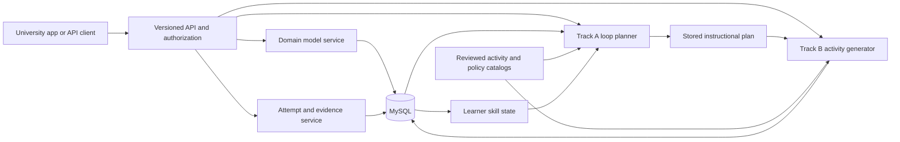

# Architecture

## Starting design

Use a modular Python service with FastAPI, SQLAlchemy 2.0, Alembic, and MySQL 8.4. One application and one database keep local development manageable. FastAPI provides request validation and OpenAPI contracts. SQLAlchemy maps records to Python objects. Alembic applies reviewed, numbered schema changes.

MySQL can store the domain graph as nodes and edges. A separate graph database is unnecessary for the small initial course. Reconsider graph infrastructure only if measured graph queries or cross-domain scale justify it.

This diagram describes the target, not the current implementation. Days 1–3 implement the API, course registry/lifecycle, draft domain versions, competencies and classified skills in MySQL, with development role/ownership checks.

## Core transaction

1. Authenticate the caller and verify permission for the learner and course.
2. Load an immutable domain version, learner evidence and state, approved policies, time budget, and generation history.
3. Resolve missing prerequisites and choose a focus. Unknown evidence is distinct from demonstrated low proficiency.
4. Persist a plan containing focus, rationale, policy versions, component sequence, support, complexity, context, and completion conditions.
5. Generate activities from the plan through a template/provider interface. Validate structure, skill alignment, time budget, rubric, and review requirements. Only approved content becomes deliverable.
6. Accept a learner attempt using an idempotency key. Derive learner identity from authorization, never solely from a submitted ID.
7. Score deterministically where possible. Hold constructed responses for an authorized review or a validated scorer; a learner cannot submit their own authoritative score.
8. In one transaction, persist evidence, append the state-update event, and update affected learner-skill rows. Lock or version those rows so simultaneous submissions cannot lose updates.
9. Return evidence provenance and the next action. Preserve whole-task context when inserting prerequisite support. A loop ends only under its explicit experimental policy; formal certification remains separate.

No score formula or evidence threshold is an approved university policy at this stage. Every experimental algorithm gets a policy version and evaluation fixtures.

## API conventions

- JSON over HTTP, versioned under `/api/v1`; UUID identifiers, UTC timestamps, bounded pagination, explicit validation and error status codes.
- Development `X-API-Key` credentials resolve server-configured principals. Day 2 enforces author role and course ownership for writes. [The identity design](08-identity-design.md) defines current roles and the proposed university adapter; [the API contract](07-api-contract.md) records current lifecycle and error semantics.
- Learner reads are scoped to self or explicitly assigned instructor roles. Authoring routes require author permissions. Assessments and content approval require their corresponding roles.
- Creates return 201 with Location, reads 200, asynchronous generation 202 with a job resource. Invalid input uses 422, unauthorized 401, forbidden 403, unknown resources 404, conflict 409. Generation and attempt POST routes gain idempotency before integration use.
- Content creation, edits, imports, publishing/review actions, enrollment, plans, attempts, model reads, reports, and job status are all API operations. No direct client access to database tables.
- Operational migrations and backups run through deployment tooling with operator credentials. Do not add an HTTP endpoint that executes arbitrary SQL.

## Planned endpoint groups

| Resource | Representative endpoints | Intended milestone |
|---|---|---|
| Courses | POST/GET `/courses`, GET/PATCH `/courses/{id}` | Day 1 create/read; Day 2 edit/archive |
| Domain | POST `/courses/{id}/domain-versions`, skills, prerequisites, validate/publish actions | Day 3 authoring implemented; Day 4 prerequisites/publishing planned |
| Learners | POST `/learners`, POST `/enrollments`, GET `/learners/{id}/state` | Day 5 |
| Catalogs | Activity types, component mappings, policy versions, review actions | Day 6 |
| Plans | POST `/learners/{id}/loop-plans`, GET `/loop-plans/{id}` | Day 7 |
| Activities | POST `/loop-plans/{id}/generations`, GET `/activities/{id}` | Day 8 |
| Evidence | POST `/activities/{id}/attempts`, POST `/attempts/{id}/reviews` | Day 9 |
| Progress | GET `/learners/{id}/progress`, POST `/loops/{id}/resume` | Days 10–11 |
| Jobs and events | GET `/jobs/{id}`, webhook registration and delivery records | Days 13–15 |

These are design sketches. Add each endpoint to actual OpenAPI when its implementation lands; do not present planned routes as working.

## Generation boundaries

The target is a personalized course experience based on each student's prior knowledge and evolving evidence. The shared domain model defines learning goals and prerequisites; each learner's state drives their own plan and generated activities. Establish initial knowledge from prior evidence or diagnostic work, preserving unknown states where evidence is missing.

For the first AI integration, configure exactly one provider/model through the generation interface. Keep its API key in server-side configuration, separate from application authentication keys. Add other provider adapters and model comparisons later without changing the learner, plan, or activity contracts. The initial provider/model remains to be selected.

Use a synchronous deterministic generator for the first demo. Later provider generation should run as a job, with explicit pending/running/validated/review-required/failed states and a persisted retry budget. Do not rely on in-process background tasks for durable jobs. Introduce a worker and queue only when that integration is implemented.

Store provider, model, prompt-template version, catalog and policy versions, output hash, latency, and cost metadata. Treat learner input and retrieved material as data, never generation instructions. Generated output is untrusted until validated. Malformed or unapproved content must not be silently published. Do not execute generated code on the API host.

## Testing and operations

Use pure decision tests for planner behavior, API tests for authorization and validation, and disposable real MySQL tests for constraints, migrations, transactions, and concurrency. Keep test databases separate from local application data. Add prompt/generation evaluation sets separately from software tests; passing API tests says nothing about teaching effectiveness.

Before release, add request IDs, structured logs that exclude credentials and learner answers, latency/error metrics, audit events for policy and content changes, rate limits, backup/restore drills, deployment health checks, and a rollback runbook. Evaluate accessibility through the host application's rendering contract and reviewed activity formats.
