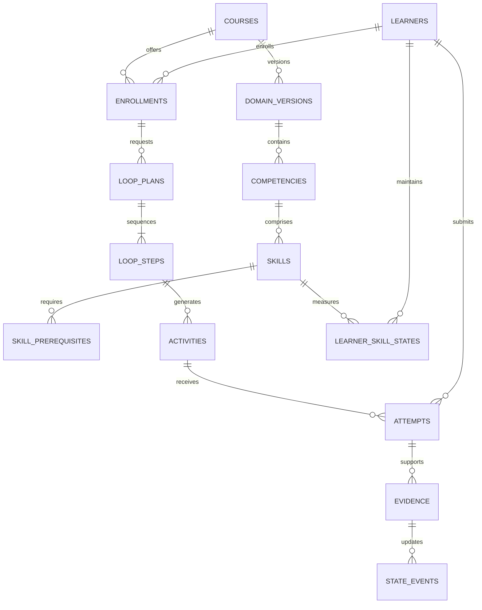

# MySQL schema design

## Implemented in migration 0001

`courses`: `id CHAR-like VARCHAR(36)` UUID primary key, `code VARCHAR(32)` unique, `title VARCHAR(200)`, `description TEXT`, and `created_at DATETIME` recorded in UTC. Strings use `utf8mb4_unicode_ci`. The API restricts course codes to ASCII identifiers and normalizes them to uppercase. All fields are non-null.

The migration is the deployed schema authority. Application startup never calls `create_all`. Application data is created through the API, including demonstration data.

## Implemented in migration 0002

Course lifecycle adds `created_by VARCHAR(128) NOT NULL`, `updated_at DATETIME NOT NULL`, and nullable `archived_at DATETIME`, all timestamps UTC. Existing courses are assigned to `dev-author`; their update time is backfilled from `created_at`. The API derives `active`/`archived` status from `archived_at`. Existing IDs and content are preserved, including unique codes after archival. Course edits and archival lock the target row within their transaction. Downgrade removes the added metadata but preserves the original course rows; it is tested only in the disposable database.

## Implemented in migration 0003

- `domain_versions`: UUID ID, `course_id` FK, positive integer `version`, `status`, and UTC `created_at`. Unique `(course_id, version)`; API allocates numbers while holding the course lock. API-created versions start `draft`. The schema reserves `published` for Day 4; no publishing endpoint exists yet.
- `competencies`: UUID ID, `domain_version_id` FK, normalized `code VARCHAR(32)`, nonempty `statement TEXT`, UTC `created_at` and `updated_at`. Unique `(domain_version_id, code)` and `(id, domain_version_id)`.
- `skills`: UUID ID, `domain_version_id` FK, `competency_id`, normalized code, title, description, `skill_kind`, `requires_automaticity`, and UTC creation/update timestamps. Unique `(domain_version_id, code)` and `(id, domain_version_id)`. A composite FK to `competencies(id, domain_version_id)` prevents cross-version assignment. Check constraints limit kind to `routine`/`non_routine`, automaticity to boolean values, and automaticity to routine skills.

All three tables use `utf8mb4_unicode_ci`. Foreign keys retain referenced records; no cascading deletes or public deletion APIs exist. Course-owned draft authoring locks course then domain and rejects archived courses. Migration 0003 adds tables without changing existing course rows or earlier migrations. Its downgrade drops the three domain tables and loses domain content; downgrade verification is confined to the disposable test database.

## Proposed next migrations

These tables are a design, not an implemented database. We will refine each with its endpoint and tests instead of installing an unvalidated full schema at once.

| Group | Tables and key fields | Integrity and indexes |
|---|---|---|
| Domain extensions | `domain_versions.published_at`; later `competencies.rubric_version_id` | Add validated publishing and rubric references to the existing Day 3 tables; published versions immutable |
| Graph | `skill_prerequisites(domain_version_id, skill_id, prerequisite_skill_id)` | Composite FKs bind both nodes to same version; unique edge; no self-edge; service checks full graph cycles |
| Learners | `learners(id, external_subject, created_at)`; `enrollments(id, learner_id, course_id, domain_version_id, status)` | Unique external subject within configured university; enrollment binds course/version; unique learner/course active enrollment policy |
| Scoring | `rubric_versions(id, competency_id, version, criteria_json, review_status)` | Immutable approved rubric; reference version in every scored attempt; resolve competency/rubric reference ordering in migration |
| Catalog | `activity_types(id, code, evidence_tier, source_reference, review_status)`; `activity_variants(id, activity_type_id, version, config_json, evidence_tier)` | Tier may vary by variant; never infer every variation is established from format alone |
| Catalog composition | `component_activity_mappings(component, activity_variant_id)`; `experience_patterns(id, version, steps_json, review_status)` | Four 4C/ID components; validated step schemas and approved variants |
| Policy | `policy_versions(id, category, version, rules_json, references_json, review_status)` | Categories: learning science, safety/ethics, decision, mastery, spacing; immutable published versions |
| Current learner state | `learner_skill_states(learner_id, domain_version_id, skill_id, band, evidence_count, revision, updated_at)` | Composite PK; same-version skill FK; unknown distinct from low band; revision supports optimistic concurrency |
| Loop plans | `loop_plans(id, enrollment_id, domain_version_id, focus_skill_id, policy_version_id, status, rationale_json, created_at)` | Same-version skill FK; retain model-state revision and policy IDs used for decision |
| Sequence | `loop_steps(id, loop_plan_id, position, component, activity_variant_id, support_level, estimated_minutes, context_key)` | Unique plan/position; positive estimated duration; explicit connections back to whole task |
| Activities | `activities(id, loop_step_id, version, content_json, rubric_version_id, generation_job_id, review_status, content_hash)`; `activity_skills(activity_id, skill_id, evidence_role)` | Frozen delivered activity version; map multi-skill whole tasks; candidate and approved states distinct |
| Attempts | `attempts(id, activity_id, learner_id, idempotency_key, request_hash, response_json, submitted_at, status)` | Unique caller/operation/idempotency key; mismatched replays return conflict; index learner/submission time |
| Evidence | `evidence(id, attempt_id, skill_id, rubric_version_id, scorer_version, evidence_kind, score, max_score, eligible, reviewed_by)` | Unique attempt/skill/scorer revision; nonnegative score, positive max, score <= max; source lineage mandatory |
| State history | `state_events(id, learner_id, skill_id, evidence_id, policy_version_id, previous_state_json, next_state_json, created_at)` | Append-only record, unique evidence/policy update as appropriate; provenance and reproducibility |
| Practice schedule | `review_schedule(learner_id, skill_id, due_at, policy_version_id)`; `generation_history(id, learner_id, activity_id, context_key, generated_at)` | Index due date and learner/skill; spacing policy experimental until evaluated |
| Integration | `generation_jobs(id, status, attempts, provider_metadata_json, error_code)`; `outbox_events(id, event_type, payload_json, status, created_at)` | Transactional outbox with bounded retries; no raw secrets in payloads |
| Audit | `audit_events(id, actor_subject, action, resource_type, resource_id, request_id, occurred_at)` | Append-only access policy; indexed actor/time and resource/time; exclude learner response bodies |

Use normalized columns and foreign keys for identities, ownership, graph relations, scores, and query paths. JSON is reserved for versioned activity content, structured rubric definitions, explanations, and policy documents. Validate JSON structure at the API boundary. MySQL does not enforce a full JSON schema automatically.

## Relationship overview

## Important rules

- All domain queries specify a domain version. Publishing a revised graph cannot silently reinterpret past evidence. Version migration/re-enrollment is explicit.
- Knowledge-graph edges use same-version composite keys. Cycle detection is a service operation and must handle simultaneous edits by locking/versioning the draft graph.
- Learner data is accessed through enrollment and authorization scope. A UUID alone does not grant permission.
- Evidence is never accepted solely because the client reports a score. Approved scorers and reviewers provide it.
- Attempts, evidence, and state changes commit atomically when scoring is synchronous. Asynchronous scoring uses durable states and idempotent state application.
- Archive courses and published content rather than deleting records needed for evidence provenance. Retention and erasure must follow the university's approved policy.
- Store timestamps consistently as UTC. Do not let local server time change schedule calculations.
- A small prototype can be single-university. A future multi-university deployment requires tenant-scoped keys, indexes, authorization, and isolation tests before onboarding another institution.
