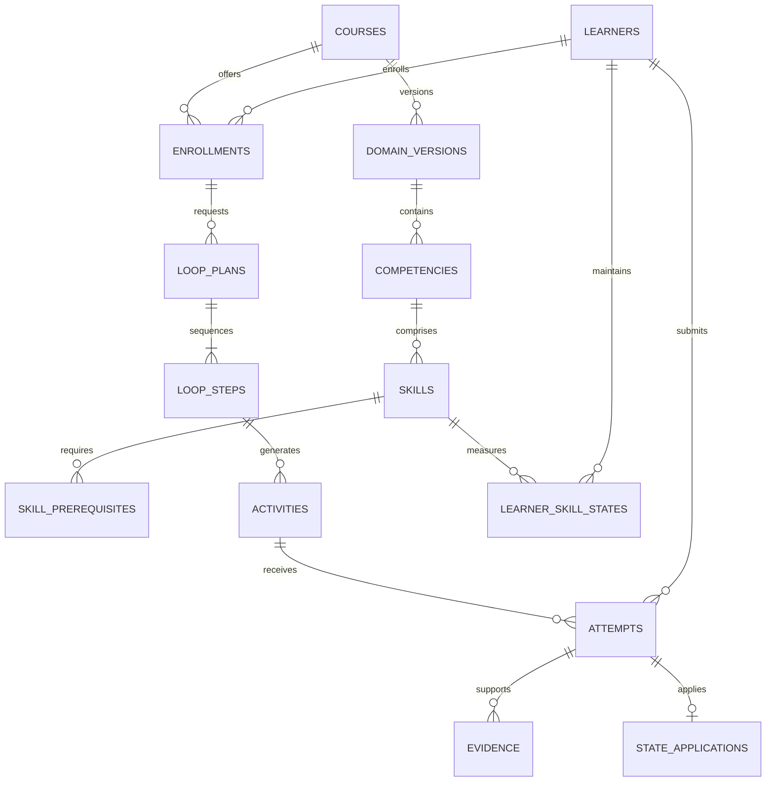

# MySQL schema design

## Implemented in migration 0001

`courses`: `id CHAR-like VARCHAR(36)` UUID primary key, `code VARCHAR(32)` unique, `title VARCHAR(200)`, `description TEXT`, and `created_at DATETIME` recorded in UTC. Strings use `utf8mb4_unicode_ci`. The API restricts course codes to ASCII identifiers and normalizes them to uppercase. All fields are non-null.

The migration is the deployed schema authority. Application startup never calls `create_all`. Application data is created through the API, including demonstration data.

## Implemented in migration 0002

Course lifecycle adds `created_by VARCHAR(128) NOT NULL`, `updated_at DATETIME NOT NULL`, and nullable `archived_at DATETIME`, all timestamps UTC. Existing courses are assigned to `dev-author`; their update time is backfilled from `created_at`. The API derives `active`/`archived` status from `archived_at`. Existing IDs and content are preserved, including unique codes after archival. Course edits and archival lock the target row within their transaction. Downgrade removes the added metadata but preserves the original course rows; it is tested only in the disposable database.

## Implemented in migration 0003

- `domain_versions`: UUID ID, `course_id` FK, positive integer `version`, `status`, and UTC `created_at`. Unique `(course_id, version)`; API allocates numbers while holding the course lock. API-created versions start `draft`; Day 4 implements the reserved `published` transition.
- `competencies`: UUID ID, `domain_version_id` FK, normalized `code VARCHAR(32)`, nonempty `statement TEXT`, UTC `created_at` and `updated_at`. Unique `(domain_version_id, code)` and `(id, domain_version_id)`.
- `skills`: UUID ID, `domain_version_id` FK, `competency_id`, normalized code, title, description, `skill_kind`, `requires_automaticity`, and UTC creation/update timestamps. Unique `(domain_version_id, code)` and `(id, domain_version_id)`. A composite FK to `competencies(id, domain_version_id)` prevents cross-version assignment. Check constraints limit kind to `routine`/`non_routine`, automaticity to boolean values, and automaticity to routine skills.

All three tables use `utf8mb4_unicode_ci`. Foreign keys retain referenced records; no cascading deletes or public deletion APIs exist. Course-owned draft authoring locks course then domain and rejects archived courses. Migration 0003 adds tables without changing existing course rows or earlier migrations. Its downgrade drops the three domain tables and loses domain content; downgrade verification is confined to the disposable test database.

## Implemented in migration 0004

- `domain_versions.published_at`: nullable UTC `DATETIME`. A check constraint requires null for drafts and non-null for published versions. Existing drafts are preserved. Any manually published legacy row gets `created_at` as a compatibility timestamp; this backfill is not evidence of earlier validation.
- `skill_prerequisites`: UUID ID, `domain_version_id` FK, `skill_id`, `prerequisite_skill_id`, UTC `created_at`. An edge means `skill_id` requires `prerequisite_skill_id`. Unique `(domain_version_id, skill_id, prerequisite_skill_id)`. Two composite FKs to `skills(id, domain_version_id)` enforce same-version endpoints, and a check rejects self-links. The table uses the same UTF-8 collation as the other domain tables.

Graph writes and publication lock course then domain. The service rejects cycles, validates nonempty competency/skill coverage and classifications, and commits publication status/timestamp together. All competency, skill and prerequisite mutations reject published domains. A draft prerequisite may be deleted; skills and published content retain their records. Cycles and immutability are service invariants, not SQL triggers.

Migration 0004 retains earlier course/domain content and leaves migrations 0001–0003 unchanged. Its downgrade deletes all prerequisite links and publication timestamps while retaining domain status, competencies and skills; subsequent upgrade backfills any retained published status with a compatibility timestamp. This loses the original publication time and is not a supported application recovery path. Downgrade testing uses only the disposable database.

## Implemented in migration 0005

- `learners`: random UUID, unique `principal_subject VARCHAR(128)` internal development identity mapping, UTC `created_at`. Subject comparison uses `utf8mb4_bin` so case-distinct authenticated subjects remain separate. Responses expose UUID and creation time only; no name, email, university ID or subject is accepted in the body. The subject mapping is still linkable identity data and requires a reviewed `(issuer, subject)` migration before university identities are enabled.
- `enrollments`: UUID, learner/course FKs, `domain_version_id`, server-controlled `active` status and UTC creation time. Unique `(learner_id, course_id)` permits one retained enrollment per course in this milestone. A new unique key on `domain_versions(id, course_id)` and composite FK enforce the enrollment's course/version boundary. Unique `(id, domain_version_id)` supports state integrity. No version transfer, withdrawal or re-enrollment lifecycle exists yet.
- `learner_skill_states`: composite primary key `(enrollment_id, skill_id)`, `domain_version_id`, `band`, `evidence_count`, `revision`, UTC `updated_at`. Composite FKs bind both enrollment and skill to the same domain. Enrollment inserts every initial skill row transactionally. Day 5's check allows only `unknown`, zero evidence and revision zero; Day 10 migration 0010 replaces this check alongside its evidence-application contract. `updated_at` initially records creation, not a demonstrated learning event.

All new tables retain the existing UTF-8 collation except the case-sensitive identity mapping column. Foreign keys retain referenced records; there are no cascading deletes or learner deletion APIs. API enrollment checks active course and published version while locking course then domain. Its existing-enrollment and initial-skill lookups are also locking reads to see the latest committed rows under MySQL repeatable-read isolation. Published-only enrollment, authorization and complete initial skill coverage are service invariants.

Migration 0005 preserves existing course, domain, competency, skill, prerequisite and publication data; migrations 0001–0004 are unchanged. Downgrade drops all learner/enrollment/state records and the new domain key. It is destructive to Day 5 data and verified only in the disposable test database.

## Implemented in migration 0006

- `policy_versions`: UUID, category (`learning_science`/`safety`), normalized code, explicit positive author-supplied version, title, required `references JSON`, typed `rules JSON`, creator and UTC creation time. Unique `(category, code, version)`. Review fields are `review_status` (`draft`/`approved`/`rejected`), fixed `review_scope: synthetic_only`, and nullable reviewer/time/note.
- `activity_variants`: the same version/review metadata; unique `(code, version)`. Format is a closed enum of worked example, selected response and constructed response. Includes provisional evidence tier, purpose, guidance, nominal duration (1–180 minutes), and two retained policy FKs. The API requires exact approved policies of the appropriate category. There is no separately editable activity-type table or delivered question/answer/rubric content yet.
- `component_activity_mappings`: composite primary key `(activity_variant_id, component)`, activity FK, and rationale. Component is restricted to the four 4C/ID names. The API requires one to four unique mappings and persists them atomically with the activity.

All tables use the existing UTF-8 collation; creator/reviewer columns use `utf8mb4_bin` to match case-sensitive subjects. Checks enforce supported values, positive version/duration, provisional/synthetic scope, null review attribution for drafts, and complete attribution by a different subject for reviewed versions. Review serializes on the version row. Identical same-reviewer retries preserve metadata; changed terminal decisions are rejected. Draft content is also immutable: correction requires a new version.

JSON shape, required mappings, approved policy categories, authorization, review transitions and immutability are service invariants. Policy documents are typed contracts; Day 7 enforces planning-related boundaries, while generation/scoring enforcement follows in those modules. Consumer reads exclude drafts/rejections; authoring reads are scoped to the submitting author or reviewing instructor. Retirement/revocation remains planned. Prototype instructor-role approval is not expert/university approval.

Migration 0006 preserves the eight existing tables and leaves migrations 0001–0005 unchanged. Downgrade drops all catalog records, losing Day 6 data; it is verified only in the disposable database. Populated learner records survive 0006 downgrade/re-upgrade tests, and full local migration row hashes match.

## Implemented in migration 0007

- `loop_plans`: UUID, enrollment/domain, target/focus skills, exact learning-science/safety policy FKs, SHA-256 input fingerprint, requested and estimated minutes, UTC creation time, decision metadata JSON and complete typed input snapshot JSON. Composite FKs enforce the enrollment/target/focus domain boundary. Unique `(enrollment_id, input_fingerprint)` retains one decision per identical versioned input. Checks enforce a 1–180 minute budget and positive total within budget.
- `loop_steps`: composite primary key `(loop_plan_id, position)`, domain, skill, exact activity FK, role, selected component list JSON, support level, full catalog duration and rationale. Composite FKs enforce same-domain plan and skill; checks constrain positive position/duration and supported role/support values. Plan metadata and normalized steps commit together.

The JSON decision excludes steps; reads assemble them from the normalized rows in position order. Its shared context key binds prerequisite support and the return to the target whole task. The complete input snapshot retains graph, state bands/counts/revisions, candidate catalog metadata and exact policy versions for replay. Authorization, approved/compatible catalog selection, eligibility, connected sequencing, summed durations and immutability are service invariants. No plan/step edit or delete API exists.

Planning locks course → domain → enrollment → states, followed by a current plan/step read for deterministic concurrent retries under MySQL repeatable-read. Read-only GET uses a consistent snapshot. At Day 7, persisted state remained initial-only and observed beginner/experienced bands were internal fixtures. Day 10 introduces authoritative evidence application and synchronizes historical scores before the plan snapshot.

Migration 0007 is additive; migrations 0001–0006 remain unchanged. Downgrade loses plans/steps and is tested only in the disposable database. Populated reviewed catalog and learner rows survive its downgrade/re-upgrade; Alembic checks model/schema agreement.

## Implemented in migration 0008

- `activity_generations`: UUID, retained plan FK, generator/template versions, canonical full-sequence SHA-256, creator and UTC creation time, attributed review status/scope/reviewer/time/note. Unique `(loop_plan_id, generator_version)` prevents duplicate template generations; unique `(id, loop_plan_id)` supports child lineage. Review checks retain draft-null metadata and a different, fully attributed terminal reviewer; scope is synthetic-only.
- `activities`: UUID, generation/plan/position, validated step/content/rubric `payload JSON`. Unique `(generation_id, position)`. Composite FKs bind both generation and step to the same saved plan. Positive positions and exact step existence are enforced by MySQL; JSON shape and plan/content consistency are service invariants.

Plan locking serializes generation retries; all steps commit atomically. No content edit/delete API exists. Instructor review atomically approves/rejects the complete sequence; approved-only learner reads remove private scoring keys. Validation replays the pinned plan, checks ordering, skills, components, support, durations, format, context, rubric and policy IDs, and verifies the content hash before approval/delivery. Catalog approval does not automatically approve newly generated content. The synthetic template/rubric remains provisional.

Migration 0008 is additive and preserves all thirteen prior tables. Populated Day 7 plans/steps survive its downgrade/re-upgrade, and Alembic checks model/schema agreement. Downgrade loses generation/content/review records and is tested only on the disposable database. Day 8 retained initial-only learner-state constraints; Day 10 replaces them explicitly.

## Implemented in migration 0009

- `attempts`: UUID, activity/plan/enrollment/domain lineage, UUID idempotency key, SHA-256 request hash, typed answer JSON, scoring method, internal submitting subject and UTC creation time. Unique `(enrollment_id, idempotency_key)` handles retries across an enrollment's plans; unique `(id, domain_version_id)` supports evidence lineage. Composite FKs bind the activity to the plan and the plan to the enrollment/domain. Added unique keys on existing activities/plans support those FKs.
- `attempt_scores`: one terminal row per attempt (PK/FK `attempt_id`), scoring method, scorer/rubric version, synthetic review scope, nullable reviewer/note and UTC creation time. Checks require complete attribution for instructor scoring and null attribution for server scoring. Pending written attempts have no score row; status is derived, so scoring does not mutate submitted answers.
- `evidence`: composite primary key `(attempt_id, criterion_code)` with case-sensitive criterion code; score FK plus same-domain attempt and skill composite FKs. Includes integer points/maxima, part-task/whole-task kind, provisional tier and false certification flag. Checks enforce nonnegative points within a positive maximum and the supported evidence scope. Criterion maxima and skill coverage are validated against the frozen rubric in the service.

Attempts and scores/evidence are immutable through the API. Selected scoring commits all three together; later instructor scoring commits its score and complete evidence set together. Current locking reads preserve retry results under MySQL repeatable-read. Evidence reaches generation content/hash, plan context, published graph and exact policy/catalog versions through retained lineage. Day 9 retained initial-only learner-state constraints; Day 10 extends this transaction with state application and history.

Migration 0009 preserves all fifteen previous tables and leaves migrations 0001–0008 unchanged. Tests verify populated Day 8 rows across downgrade/re-upgrade and Alembic schema agreement; complete local row hashes also match. Downgrade drops all new attempts/scores/evidence before removing the added lineage keys and is verified only in the disposable database. Authorization, terminal review, self-review denial, JSON shape and content integrity remain service invariants; direct operator SQL can bypass them.

## Day 10 implemented state application

Migration `0010_state_application` replaces the initial-only state constraint and adds `state_applications`, keyed by terminal score/attempt. Composite keys enforce the same attempt/enrollment/domain lineage. Each application pins `provisional-mastery-v1` and stores criterion codes and exact before/after values per skill in typed JSON; the originating evidence retains points and whole-task/part-task kind. There is no application edit/delete API.

Skill states now expose whole-task criterion counts, part-task criterion counts, whole-task attempt counts, cumulative whole-task points/maxima and nullable policy version. A revision counts one scored attempt per skill, even with multiple rubric criteria. Evidence counts count criteria. Unknown retains zero counts/revision and no policy. Observed bands require evidence and provenance. Secure additionally requires two whole-task attempts and at least 80% cumulative whole-task points; part-task points are excluded. These constraints implement a synthetic provisional engineering policy, not a university-approved assessment rule.

Course → enrollment locking serializes scoring, historical application and planning. Score, evidence, affected states and the application marker commit together. Historical Day 9 scores remain unchanged and can be applied through the learner synchronization API, scoring/retries or next-plan creation. The migration itself does not infer state or rewrite evidence. Old plan fingerprints remain replayable when their state snapshots lack the new optional policy version.

All original columns and rows survive the local migration. The disposable database verifies populated Day 9 downgrade/re-upgrade and schema agreement. Downgrade refuses before DDL when observed state exists; restore a pre-Day-10 backup to return to the initial-only model. MySQL DDL is not transactional, so operators must still back up before migrations. See `16-day-10.md` for the application contract and policy limitations.

## Proposed next migrations

These tables are a design, not an implemented database. We will refine each with its endpoint and tests instead of installing an unvalidated full schema at once.

| Group | Tables and key fields | Integrity and indexes |
|---|---|---|
| Domain extensions | `competencies.rubric_version_id` | Add reviewed rubric references to the existing domain tables |
| Learner lifecycle extensions | Institution-scoped verified identity mapping; enrollment transitions and domain transfers | Explicit university mapping/retention policy; preserve evidence and version boundaries |
| Scoring | `rubric_versions(id, competency_id, version, criteria_json, review_status)` | Immutable approved rubric; reference version in every scored attempt; resolve competency/rubric reference ordering in migration |
| Catalog extensions | Editable activity-type registry, additional configuration, retirement/revocation | Minimal variants/mappings are implemented; future evidence tiers need variation-specific review |
| Catalog composition extensions | `experience_patterns(id, version, steps_json, review_status)` | Validated connected step schemas referencing exact approved variants |
| Policy extensions | Extend implemented policy versions with decision, mastery and spacing schemas | Immutable versions with reviewed category-specific contracts; no invented thresholds |
| Learner state policy extensions | Reviewed/calibrated policies and explicit policy migration | Day 10 provisional bands and application history are implemented; preserve evidence and history when changing policy |
| Activity extensions | Standalone reviewed rubric versions, normalized multi-skill evidence mappings and generation job FK on existing frozen activities | Day 8 stores typed content/rubric snapshots and target/focus alignment; richer authoring and provider jobs remain planned |
| Evidence extensions | Versioned regrading/corrections, standalone rubric revisions and explicit state-application policy | Preserve original terminal scores and append attributed revisions; no evidence rewriting |
| State history extensions | Richer reporting/indexes on implemented `state_applications` | Day 10 already records one immutable application per terminal attempt and typed per-skill transitions |
| Practice schedule | `review_schedule(learner_id, skill_id, due_at, policy_version_id)`; `generation_history(id, learner_id, activity_id, context_key, generated_at)` | Index due date and learner/skill; spacing policy experimental until evaluated |
| Integration | `generation_jobs(id, status, attempts, provider_metadata_json, error_code)`; `outbox_events(id, event_type, payload_json, status, created_at)` | Transactional outbox with bounded retries; no raw secrets in payloads |
| Audit | `audit_events(id, actor_subject, action, resource_type, resource_id, request_id, occurred_at)` | Append-only access policy; indexed actor/time and resource/time; exclude learner response bodies |

Use normalized columns and foreign keys for identities, ownership, graph relations, scores, and query paths. JSON is reserved for versioned activity content, structured rubric definitions, explanations, and policy documents. Validate JSON structure at the API boundary. MySQL does not enforce a full JSON schema automatically.

## Relationship overview

## Important rules

- All domain queries specify a domain version. Publishing a revised graph cannot silently reinterpret past evidence. Version migration/re-enrollment is explicit.
- Knowledge-graph edges use same-version composite keys. Cycle detection is a service operation and must handle simultaneous edits by locking/versioning the draft graph.
- Learner data is accessed through enrollment and authorization scope. A UUID alone does not grant permission.
- Evidence is never accepted solely because the client reports a score. Approved scorers and reviewers provide it.
- Attempts, evidence, and state changes commit atomically when scoring is synchronous. Asynchronous scoring uses durable states and idempotent state application.
- Archive courses and published content rather than deleting records needed for evidence provenance. Retention and erasure must follow the university's approved policy.
- Store timestamps consistently as UTC. Do not let local server time change schedule calculations.
- A small prototype can be single-university. A future multi-university deployment requires tenant-scoped keys, indexes, authorization, and isolation tests before onboarding another institution.
