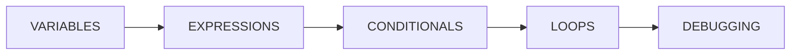

# Day 4: prerequisite graphs and immutable publishing

Day 4 records which skills must come before others and freezes a validated course structure. Future learner evidence can reference that exact version. This is a structural graph; it does not yet assess prior knowledge, choose a student's next activity, or generate content.

## Understand the prerequisite direction

An edge with `skill_id = EXPRESSIONS` and `prerequisite_skill_id = VARIABLES` means expressions require variables. The synthetic pilot uses this chain:



This is a provisional example, not a university-approved curriculum. Skills in different competencies may be connected when they belong to the same domain version. Independent skills and multiple roots are valid; every skill does not need a prerequisite. Self-links, duplicate links, cross-version endpoints and cycles are rejected. Cycle checking is iterative and reads the whole graph rather than a paginated subset.

## Run the demonstration

From the project directory, with Docker Desktop running:

```bash
docker compose up --build -d --wait api
docker compose --profile test run --build --rm tests

# Reuse and publish the existing Day 3 pilot.
python3 scripts/demo_day4.py \
  --course-id 902a24a1-efa5-4172-a261-527f89e03c63 \
  --domain-version-id 3288966b-a0cf-440b-8520-582f52cc88fa
```

The demonstration adds four links, validates prerequisite-first ordering, rejects a self-link and a cycle, denies learner publishing, publishes the version, verifies a repeated publish returns the same timestamp, and rejects an edit after publishing. It reads credentials from `.env` without printing them. Running it again on the same published pilot verifies retained content and protection; it does not create another version.

To create an additional synthetic course rather than reuse the earlier pilot, run `python3 scripts/demo_day4.py` without arguments. It creates one competency, five skills and four links, then publishes the new version. Parent IDs must be supplied together when selecting an existing pilot.

## Try it yourself in Swagger

Open <http://localhost:8000/docs>, authorize with the local author key, and expand **domain authoring**. All paths below start with `/api/v1/courses/{course_id}/domain-versions/{domain_version_id}`.

1. GET the existing version, its `/skills`, and `/prerequisites`. Note `status` and `published_at`.
2. For hands-on authoring, create a new empty draft with POST `/api/v1/courses/{course_id}/domain-versions` and `{}`. Existing published content cannot be edited or cloned through this API. Add a competency and at least two skills using the Day 3 walkthrough.
3. POST `/prerequisites` with the IDs of two skills in that draft:

   ```json
   {
     "skill_id": "<dependent skill UUID>",
     "prerequisite_skill_id": "<required skill UUID>"
   }
   ```

4. Try the same UUID for both fields: expect 422. Try a skill from another version: expect 404. Add the reverse of an existing link: expect 409. Repeating an existing link also returns 409.
5. To correct a draft link, DELETE `/prerequisites/{prerequisite_id}`: expect 204 with no response body. A removed link then returns 404. The two skills are retained.
6. POST `/validate` with `{}`. It returns 200 with `valid`, `issues`, and `topological_skill_ids`. An incomplete draft is a successful validation request with `valid: false`; the IDs in each issue identify the resources to fix.
7. POST `/publish` with `{}`. A complete draft returns 200 with `status: published` and a UTC `published_at`. An incomplete draft returns 422 with the validation report under `detail`, and remains draft.
8. Try creating/editing a competency or skill, or adding/removing a link in that published version: expect 409. GETs and validation still work. For later revisions, create and author a new draft.

## What publishing validates

- At least one competency and one skill exist.
- Every competency contains at least one skill.
- Each skill belongs to a competency in the same version and has a valid routine/automaticity classification.
- Every prerequisite endpoint belongs to this version and the graph is acyclic.

Descriptions may remain empty under the existing authoring contract. The validation order places prerequisites before dependents, breaking ties by skill code. It is a structural order, not a personalized instructional sequence or a claim of learning efficacy.

## Permissions and concurrency

The owning author may edit and publish only while the course is active. All development metadata readers may inspect links and request validation, including after archival. Publish retries return the same stored version while the course is active; after archival publish requests return 409.

Every graph mutation, validation and publication locks course first, then domain. Validation is read-only but briefly uses these locks to obtain a coherent report. Opposing concurrent links cannot both commit. A graph edit racing publication either commits before validation or sees a published domain and is rejected. Status and publication timestamp commit together. New drafts do not modify previous published versions.

Foreign keys reject cross-version endpoints directly in MySQL. Check constraints reject self-links and mismatched publication status/timestamp. Cycle detection and content immutability are service rules, not database triggers: operator SQL can bypass them. Publication rechecks the full graph to catch an invalid out-of-band draft before publishing.

## Follow the code and review your work

Read `app/domain_schemas.py` → `app/domains.py` → `app/domain_graph.py` → `app/models.py` → `migrations/versions/0004_domain_publishing.py`. Existing migrations remain unchanged. `tests/test_graph_contract.py` covers input/authentication and long graphs; `tests/test_graph_mysql.py` covers persistence, scope, publication, constraints and simultaneous requests.

The Day 4 migration retains earlier course/domain records and adds one table and one nullable publication timestamp. A downgrade removes prerequisite links and publication timestamps; only the disposable test database is downgraded during verification. No application database downgrade is needed.

Suggested personal review: inspect the pilot in Swagger, create a separate draft and deliberately fail validation, correct it, then publish and observe edit rejection. Record actual time in `daily-updates.md`. Day 5 introduces pseudonymous learners, enrollments and permission-scoped learner state.
